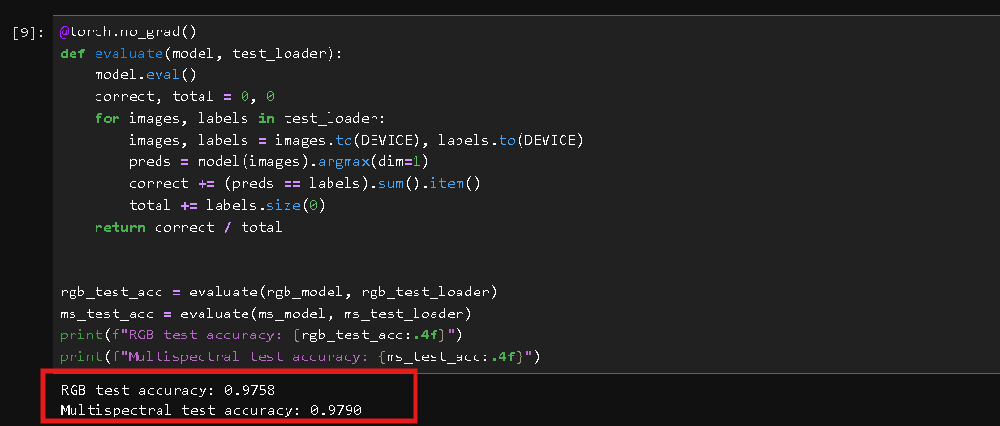
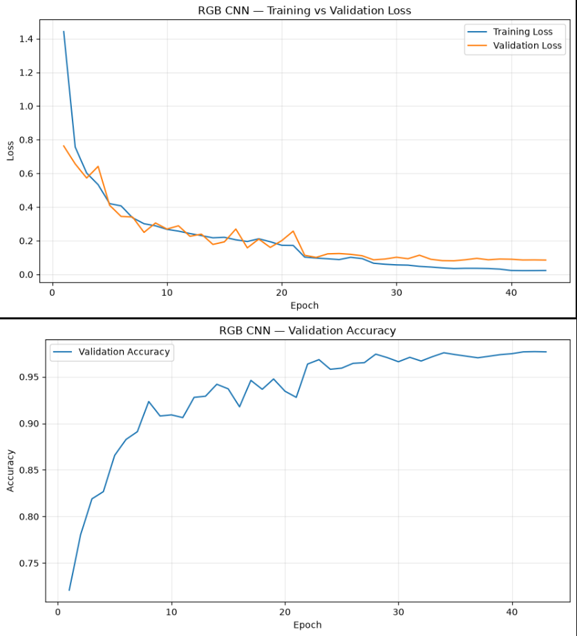
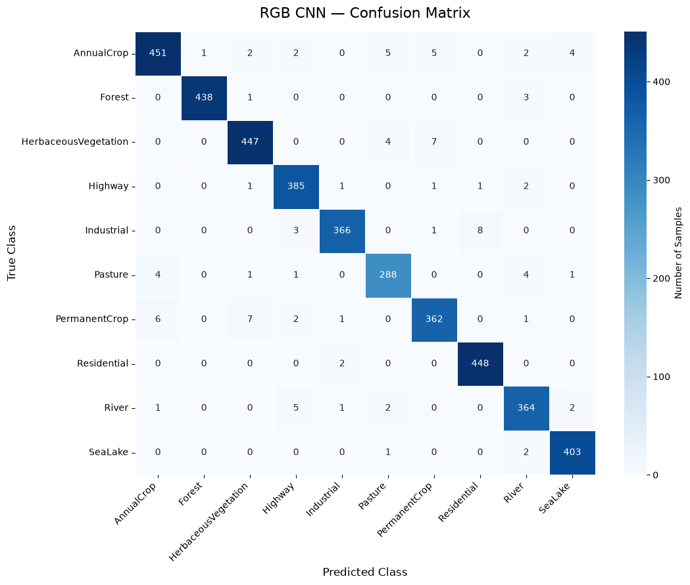
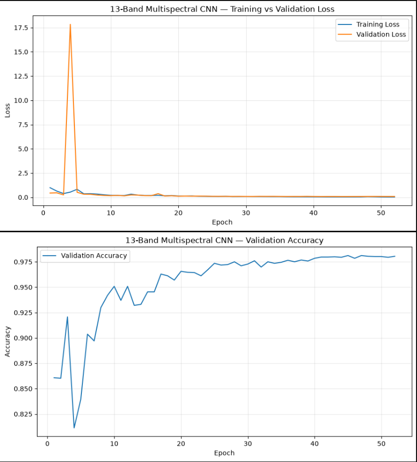
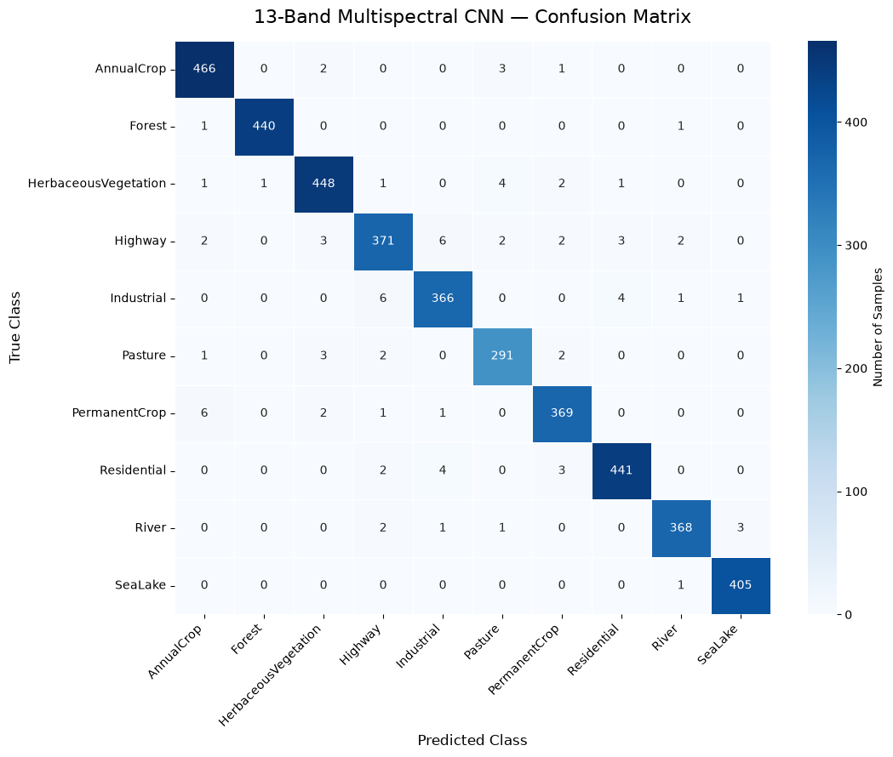

# EuroSAT Dual-Mode Land Cover Classifier

Production-grade computer vision system for satellite land-cover classification, deployed as two independently trained models — RGB and 13-band Sentinel-2 multispectral — behind a single Streamlit application, built around a zero-distribution-shift preprocessing guarantee.

---

## Live Demo

**[🛰️ Try the Live Application](https://eurosat-land-cover-classification.streamlit.app/)**

Upload an RGB satellite image or a genuine 13-band Sentinel-2 GeoTIFF and get a land-cover prediction across 10 EuroSAT classes with confidence scores.

## Problem Statement

[EuroSAT](https://github.com/phelber/EuroSAT) is a 10-class land-use/land-cover classification benchmark built from Sentinel-2 satellite imagery: `AnnualCrop`, `Forest`, `HerbaceousVegetation`, `Highway`, `Industrial`, `Pasture`, `PermanentCrop`, `Residential`, `River`, `SeaLake`. It ships in two forms — a simplified 3-channel RGB version, and the genuine 13-band multispectral Sentinel-2 L1C product.

Most public solutions target only the RGB variant. This project tackles both, because they present genuinely different engineering problems:

- **RGB** is a conventional image classification task and a natural target for standard `torchvision` transforms and a from-scratch CNN.
- **Multispectral** requires handling raw digital-number GeoTIFFs, per-band statistics that differ by orders of magnitude (e.g. cirrus band B10 vs. the visible bands), and a preprocessing pipeline that has no equivalent in standard image libraries.

The target is **≥95% test accuracy**, benchmarked against the reference performance level reported in the community EuroSAT notebooks (e.g. the widely-cited `nilesh789` Kaggle notebook), starting from a baseline of a 90.95%-accuracy MLP/CNN on Fashion-MNIST.

## Why This Project Exists

The starting point was a basic CNN on Fashion-MNIST. It performed well offline (90.95% accuracy) but exposed a problem the moment deployment was considered: **nothing in that pipeline guaranteed that a real, user-uploaded image would be preprocessed identically to a training-set tensor.** Any mismatch there — a different resize algorithm, recomputed normalization statistics, a forgotten channel-order swap — silently degrades production accuracy in a way that's invisible until it's already live.

This project treats that problem as the primary engineering constraint, not an afterthought, and picks a harder dataset (satellite imagery, two modalities, 13-band scientific data) specifically to stress-test the solution.

## Architecture

Both models share one architecture definition, `SEResEuroNet` — a custom ResNet-style network with Squeeze-and-Excitation (SE) attention, written in raw PyTorch (no pretrained backbones, no external model zoo dependency). The only difference between the two deployed models is `in_channels` (3 vs. 13).

```
Input (B, Cin, 64, 64)                    Cin = 3 (RGB) or 13 (multispectral)
      │
      ▼
Stem: 3x3 Conv → BN → ReLU               Cin → 64,  64x64
      │
      ▼
Stage 1: 2x SE-Residual Block            64 → 64,   64x64   (stride 1)
      │
      ▼
Stage 2: 2x SE-Residual Block            64 → 128,  32x32   (stride 2)
      │
      ▼
Stage 3: 2x SE-Residual Block            128 → 256, 16x16   (stride 2)
      │
      ▼
Stage 4: 2x SE-Residual Block            256 → 512, 8x8     (stride 2)
      │
      ▼
Global Average Pool → Dropout(0.3) → Linear(512 → 10)
      │
      ▼
Class logits (B, 10)
```

Each **SE-Residual Block** is a pre-activation residual unit (`BN → ReLU → Conv`, twice) with a Squeeze-and-Excitation gate applied to its output before the skip connection is summed back in:

```
x ──────────────────────────────────────────┐
│                                            │
▼                                            │
BN → ReLU → 3x3 Conv → BN → ReLU → 3x3 Conv  │
│                                            │
▼                                            │
Squeeze-Excitation (channel attention gate)  │
│                                            │
▼                                            │
  + ◄──────────────────────────────────────┘   (1x1 projection if shape changes)
  │
  ▼
out
```

The SE gate lets the network learn, per class, which channels carry the most discriminative signal — e.g. near-infrared-heavy bands for vegetation classes in the multispectral model — rather than treating every input channel with equal fixed weight.

## Distribution-Shift Mitigation

The core guarantee of this project: **the exact same normalization constants are used at training time and at inference time, and those constants are never recomputed after the initial training run.**

1. Per-channel mean and standard deviation are computed once, over the raw (unnormalized) training split, for both the RGB and multispectral pipelines.
2. Those constants are frozen to a single file, `normalization_stats.json`, versioned alongside the model weights.
3. Training transforms, evaluation transforms, and the streamlit app's inference-time preprocessing all read from that one file — none of them ever recompute statistics from a live batch or a single upload.
4. Resize interpolation mode (bilinear) and target resolution (64×64) are likewise fixed constants shared across training and inference code paths, since interpolation choice alone can shift pixel statistics enough to matter.

```
normalization_stats.json
        │
        ├──► training pipeline (Notebook_guide.md)      → produces model weights
        │
        └──► inference pipeline (app.py)                → consumes model weights
```

Because both consumers read the same frozen artifact instead of each computing their own version of "how to normalize an image," there is no code path in this project where training-time and inference-time preprocessing can silently diverge.


## Results

| Model | Modality | Input channels | Test accuracy |
|---|---|---|---|
| SE-ResEuroNet (RGB) | 3-channel RGB | 3 | 97.58% |
| SE-ResEuroNet (Multispectral) | 13-band Sentinel-2 L1C | 13 | 97.90% |




## Some Visualisations







## 🤗 Model Availability

The trained RGB and 13-band multispectral checkpoints are hosted on the Hugging Face Hub:

**[EuroSAT Land Cover Models — Hugging Face](https://huggingface.co/MallikarjunJadi/eurosat-land-cover-models)**

The Streamlit application downloads the model checkpoints from Hugging Face at runtime, keeping large `.pt` files out of the GitHub repository.


## Repository Structure

```
.
├── .gitignore
├── app.py              
├── CNNonEuroSat.ipynb           
├── model.py                                
├── normalization_stats.json    
├── README.md
├── requiremwnts.txt
└── src
    ├── data.py
    ├── model.py
    ├── train.py
    ├── RGB_graphs.png
    ├── RGB_Confusion_matrix.png
    ├── 13B_graphs.png
    ├── 13B_Confusion_matrix.png
    └── accuracy.png


```

## Getting Started

### Run Locally

```bash
git clone https://github.com/MallikarjunJD/eurosat-land-cover-classification.git
cd eurosat-land-cover-classification

pip install -r requirements.txt

streamlit run app.py

### `requirements.txt`

```

## Rquirements

```
torch>=2.1
torchvision>=0.16
streamlit
tifffile>=2023.7.10
numpy>=1.24
Pillow>=10.0
huggingface_hub
imagecodecs
```

## Engineering Standards

- **No pretrained backbones, no black-box model zoo** — the architecture is written from first principles in raw PyTorch so every tensor transformation is auditable.
- **Single source of truth for preprocessing** — one JSON contract, no duplicated normalization logic between training and serving code.
- **Deterministic evaluation** — validation/test transforms never include randomized augmentation; only the training split does.
- **Early stopping + adaptive LR scheduling** — training restores the best validation checkpoint, not the last epoch's weights, and reduces the learning rate on loss plateaus rather than using a fixed decay schedule.
- **Modality-agnostic architecture** — one model class serves both a 3-channel and a 13-channel input purely via a constructor argument, rather than maintaining two forked architectures.

## Roadmap

This is a **standalone project** and is not part of any broader roadmap, course series, or multi-part tutorial. 

Its sole purpose is to challenge my Convolutional Neural Network (CNN) skills, experiment with advanced architectures, and push for the highest possible accuracy on this specific problem.

## Author

**Mallikarjun Jadi**

Computer Science Engineering Student

Machine Learning Engineer | Full Stack Developer

## License

MIT — see `LICENSE`.

